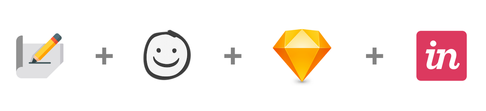
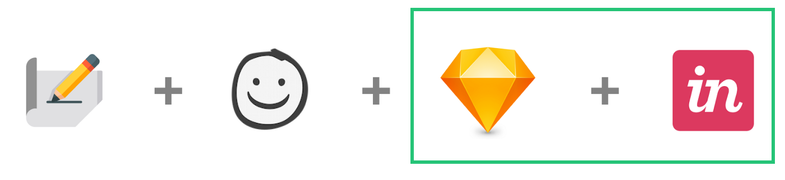
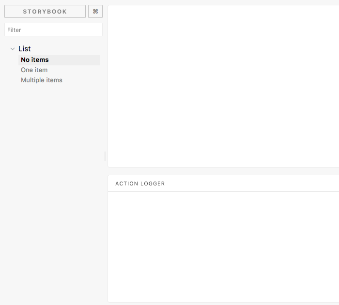
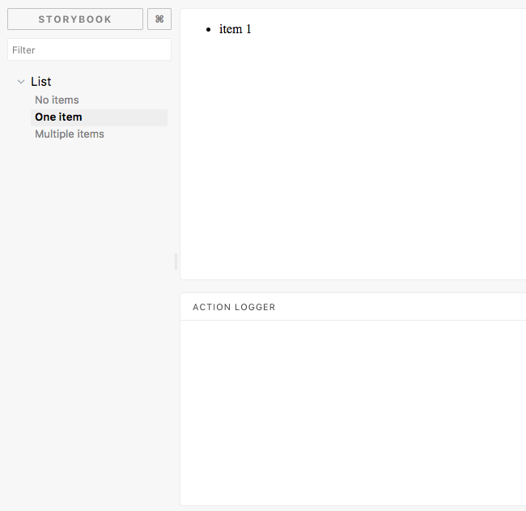
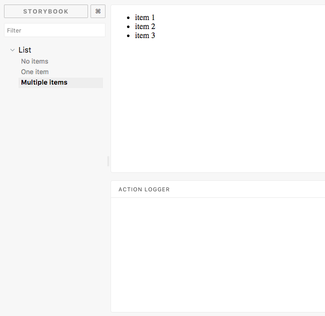
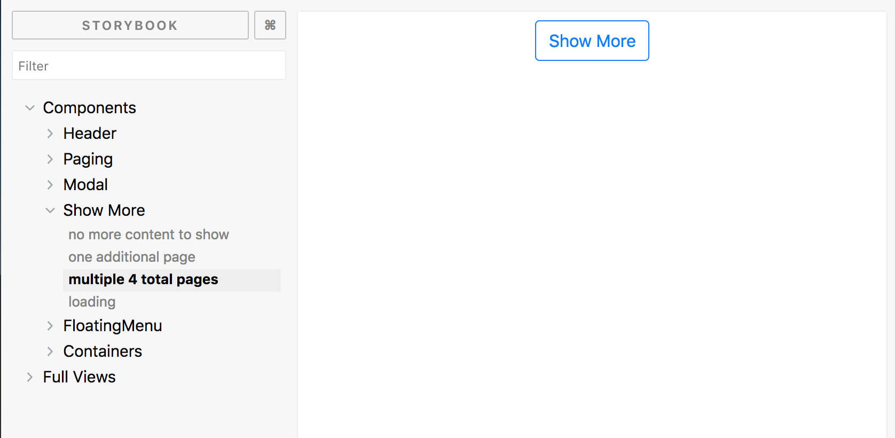

title: Design for Succcess with React and Storybook.js
controls: false
style: storybook.css
theme: ./node_modules/reveal-cleaver-theme
--

# Design for Success
## with React and Storybooks

-- intro-slide

# Chris Saylor

## Lead Engineer @ Zumba

@cjsaylor

--

## View the slides


goo.gl/Y33QR9

--

# Design?
## That's someone elses job.

-- sketchapp

Ugh, another sketch/photoshop slice job. Maybe, if I had been involved...

--

### Why do we do it?

* No code involved, so designers can work autonomously
* Developers usually viewed as "bad" designers
* Developers say no too often

--

### Why Should we care about design?

Bad UX designs makes us susceptible to disruption.

--


--

### Common Design Workflow



### = ?

<small>Image source: <a href="https://medium.com/@nicolesaidy/how-to-streamline-your-ui-ux-workflow-with-figma-b72c30596435">@nicolesaidy</a></small>

--

# How do we bridge the gap?

--

### ~~Common~~ Design Workflow



### = ?

<small>Image source: <a href="https://medium.com/@nicolesaidy/how-to-streamline-your-ui-ux-workflow-with-figma-b72c30596435">@nicolesaidy</a></small>

--

# Storybook.js

-- storybook

--

### Why not just create an html styleguide?
* Gets stale almost immediately.
* The language barrier between designers and developers makes it hard to reference.

--

### Why Storybook.js?
* Integrates with React, Vue.js, and Angular
* Immediate feedback of changes
* Easily see history of changes
* At the end of the design phase, we have functional components!

--

# How?

--

### Keep data retrieval separate

--

### Typical React Tutorial Component

```jsx
export default class ListComponent extends React.Component {
    state = { items: [] }

    async componentDidMount() {
        this.setState({
            items: await fetch('/items')
        });
    }

    renderItems() {
        return this.state.items.map(item => <li>{item}</li>)
    }

    render = () => (
        <ul>{ this.renderItems() }</ul>
    )
}
```

--

# Separate!

--

### Use props to display
```jsx
export default class ListComponent extends React.Component {

    renderItems = () => {
        return (this.props.items || [])
            .map(item => <li>{item}</li>)
    }

    render = () => <ul>{ this.renderItems() }</ul>
}
```

--

### Pass the state data to the view
```jsx
import List from './list-component';
export default class ListContainer extends React.Component {

    state = { items: [] }

    async componentDidMount() {
        this.setState({
            items: await fetch('/items')
        });
    }

    render = () => <List items={this.state.items}/>
}
```

--

# Storytime!

--

```jsx
import { storiesOf } from '@storybook/react';
import List from './list-component';

storiesOf('List', module)
    .add('No items', () => <List />)
    .add('One item', () => <List items={['item 1']} />)
    .add('Multiple items', () => (
        <List items={['item 1', 'item 2', 'item 3']} />
    ));

```

--



--



--



--

### Storybook Capabilities

* Show when user actions occur in the view

-- actions

--

### Add a click action

```jsx
export default class ListComponent extends React.Component {

    onClick = (e) => {
        this.props.onItemClicked(e.target.innerText);
    }

    renderItems = () => {
        return (this.props.items || [])
            .map(item => (
                <li onClick={this.onClick}>{item}</li>
            ));
    }

    render = () => <ul>{ this.renderItems() }</ul>

}
```

--

### Add the "actions" addon

```bash
$ npm install @storybook/addon-actions
```

```js
// addons.js
import '@storybook/addon-actions/register';
```

This is what is responsible for showing the action panel

--

### Modify our story for the action

```jsx
import { storiesOf } from '@storybook/react';
import { action } from '@storybook/addon-actions';
import List from './list-component';

storiesOf('List', module)
    .add('Multiple items', () => {
        return (
            <List
                onItemClicked={action('Item clicked!')}
                items={['item 1', 'item 2', 'item 3']}
            />
        );
    });

```

--

### Storybook Capabilities

* Allow User Input In Stories

-- knobs

--

### Add the "knobs" addon

```bash
$ npm install @storybook/addon-knobs
```

```js
// addons.js
import '@storybook/addon-knobs/register';
```

This is what is responsible for showing the panel

--

### Modify the story
```jsx
import { storiesOf } from '@storybook/react';
import List from './list-component';
import { action } from '@storybook/addon-actions';
import {withKnobs, array} from '@storybook/addon-knobs';

storiesOf('List', module)
	.addDecorator(withKnobs)
	.add('Multiple items', () => (
        <List
            onItemClicked={action('Item clicked!')}
            items={
                array('Items', [
                    'item 1',
                    'item 2',
                    'item 3'
                ])
            }
        />
    ));
```

--

### Storybook Capabilities

* Interactive Unit Tests

-- unittest

--

# Utilize in Your Workflow

--

### Styleguides

* Show what components are available for composition
* Can show full page layouts

--



--


--

### Prototyping

* No backend required
* Get a feel for the product before investing in backend integration

--

### Product Demos

* Stitch together stories With the `link` addon to demo a product.

--

# Case Studies

-- case-studies

--

### Conclusion

* Getting involved in the design process doesn't have to be scary
* Start fresh or add to existing React/VueJS app
* Hit the ground running when designs are finished
* Version control designs and their stories

--

# Questions?

--

### Resources

* https://github.com/cjsaylor/design-for-success-slides
* https://www.chris-saylor.com/design-for-success-slides/example
* https://www.chris-saylor.com/design-for-success-slides/slides
* http://www.styleguidedrivendevelopment.com/

--

# Fin